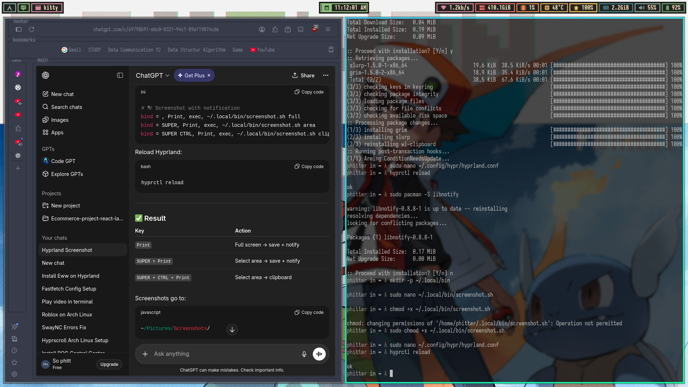
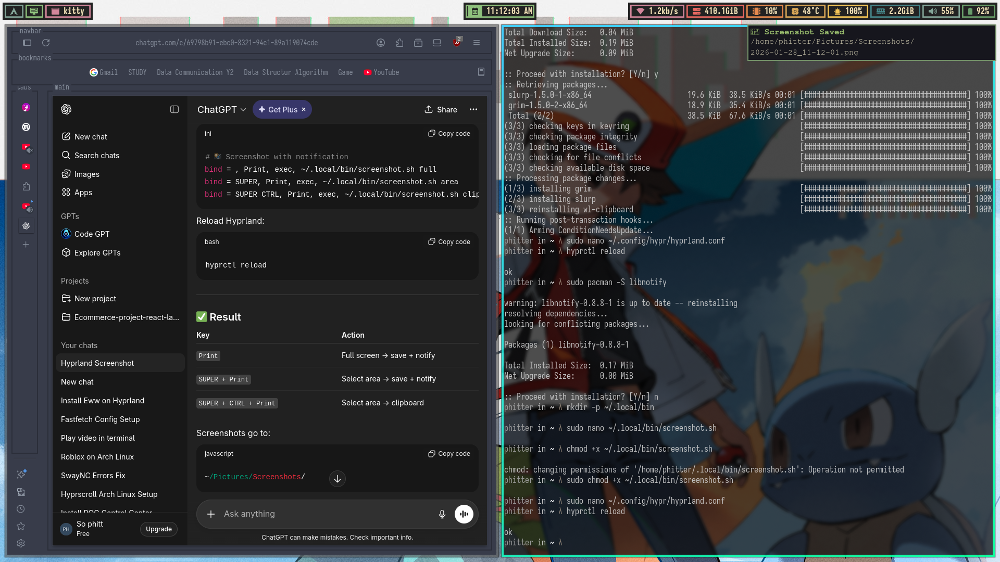
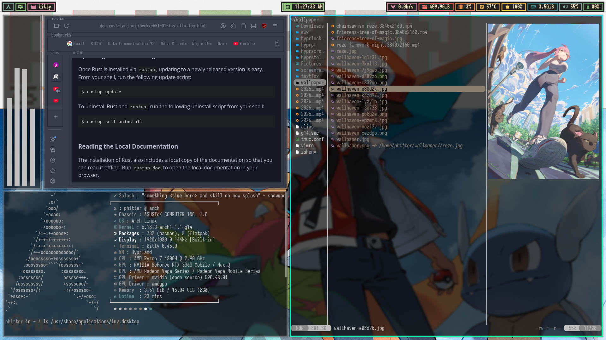
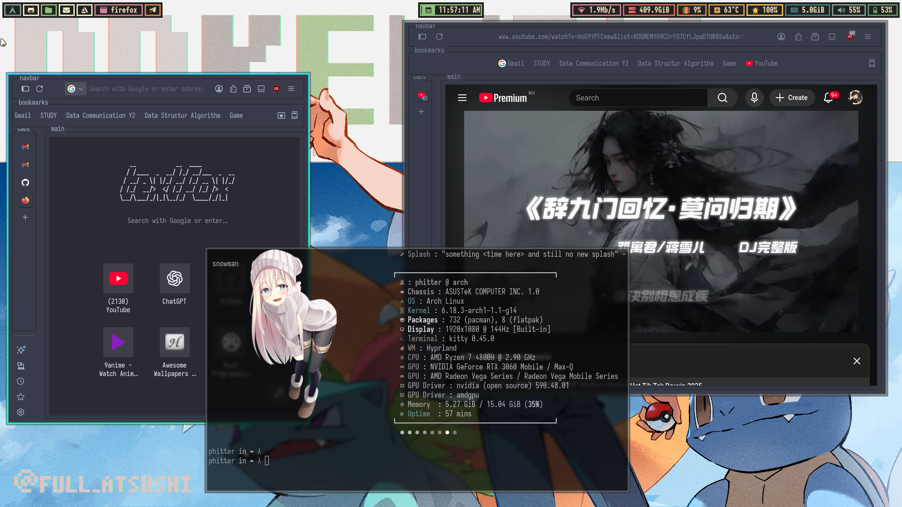
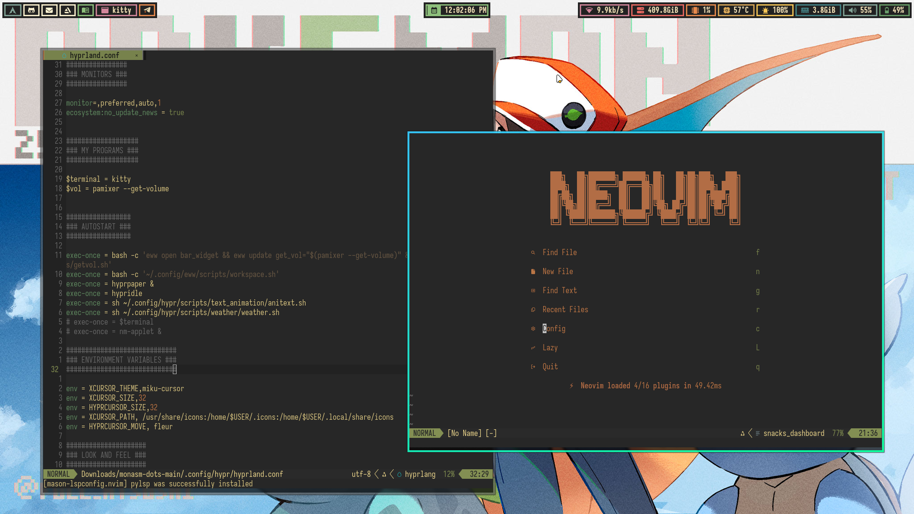
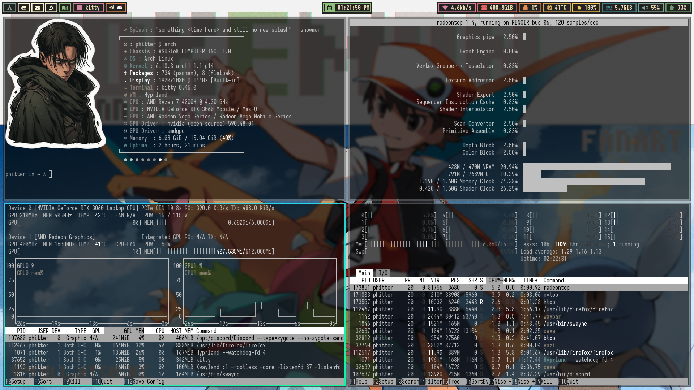
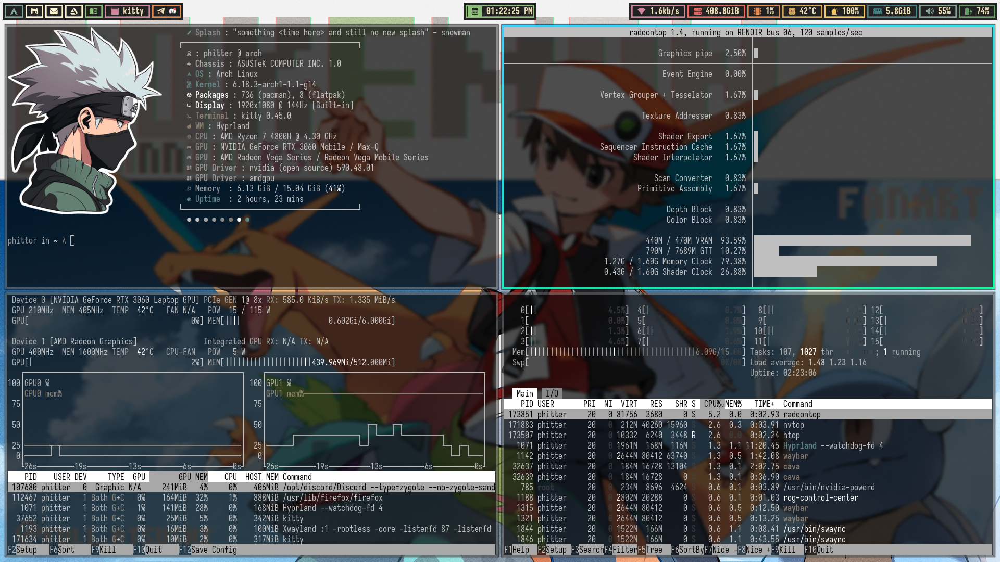
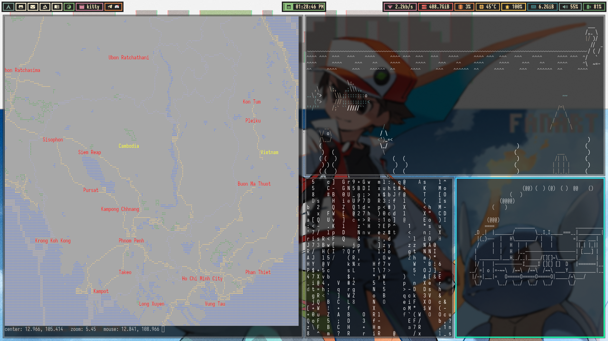

# Dotfiles - Archlinux Hyprland

My personal dotfiles repository for Archlinux with Hyprland window manager configuration.

## Showcase
















## �📋 Overview

This repository contains my complete configuration files for:
- **Hyprland**: A dynamic tiling Wayland compositor
- **Archlinux**: Minimalist Linux distribution
- **Application Configs**: Various tools and terminal applications

## 🎨 What's Included

### Window Manager
- **Hyprland**: Modern Wayland compositor with extensive keybindings and animations

### Terminal & Shell
- **Zsh**: Shell configuration with custom prompt
- **Terminal**: Terminal emulator configuration

### Utilities & Tools
- **Git**: Git configuration and aliases
- **VS Code**: Editor settings and extensions configuration
- **Various CLI tools**: Development and productivity tools

### System Configuration
- **systemd**: User service configurations
- **XDG**: Default applications and directory specifications

## 📁 Directory Structure

```
.config/
├── hypr/                 # Hyprland configuration
├── Code/                 # VS Code settings
├── zsh/                  # Zsh shell configuration
├── git/                  # Git configuration
└── ...                   # Other application configs

.local/
├── share/                # User data files
└── bin/                  # Custom scripts

.gitignore               # Git ignore rules
```

## 🚀 Installation

### Prerequisites

Ensure you have Archlinux installed and have basic system access.

### Quick Setup

1. **Clone the repository**:
   ```bash
   git clone https://github.com/buoysophit/Dotfiles-Archlinux-Hyprland.git ~/Dotfiles-Archlinux-Hyprland
   cd ~/Dotfiles-Archlinux-Hyprland
   ```

2. **Backup existing configs** (optional but recommended):
   ```bash
   cp -r ~/.config ~/.config.backup
   cp -r ~/.local ~/.local.backup
   ```

3. **Copy dotfiles to your home directory**:
   ```bash
   cp -r .config/* ~/.config/
   cp -r .local/* ~/.local/
   # Copy any root-level dotfiles as needed
   ```

4. **Install dependencies** (adjust based on your needs):
   ```bash
   sudo pacman -S hyprland hyprpaper hyprlock waybar wofi wl-clipboard
   ```

5. **Reload your session**:
   - Log out and log back in, or
   - Restart your system

## ⌨️ Keybindings

Check `~/.config/hypr/hyprland.conf` for detailed keybinding configuration.

Common keybindings:
- `SUPER` = Windows/Meta key
- `SUPER + RETURN` = Open terminal
- `SUPER + Q` = Close window
- `SUPER + D` = Open application launcher
- Arrow keys / HJKL = Window navigation

## 🛠️ Customization

### Hyprland Configuration

Edit `~/.config/hypr/hyprland.conf` to customize:
- Monitor settings
- Keybindings
- Window rules
- Animations
- Visual effects

### Terminal Colors & Fonts

Modify the respective config files in `~/.config/` for your terminal emulator.

### VS Code Settings

VS Code will sync settings automatically. Manual edits can be made in `~/.config/Code/User/settings.json`

## 📦 Recommended Packages

```bash
# Window Manager
sudo pacman -S hyprland hyprpaper hyprlock waybar

# Terminal & Shell
sudo pacman -S zsh zsh-completions

# Utilities
sudo pacman -S git neovim wget curl

# Development
sudo pacman -S python nodejs npm base-devel

# AUR Helper (optional)
sudo pacman -S yay
```

## 🔧 Troubleshooting

### Hyprland won't start
- Ensure you have a compatible GPU driver installed
- Check `~/.config/hypr/hyprland.conf` for syntax errors
- Review systemd logs: `journalctl -xe`

### Missing keybindings
- Verify keybinds in `hyprland.conf`
- Check if conflicting applications are running

### Config not loading
- Ensure files are in the correct location: `~/.config/hypr/`
- Check file permissions: `chmod 644 ~/.config/hypr/hyprland.conf`

## 📝 Notes

- These configurations are tailored to my personal workflow
- Feel free to fork and customize for your own needs
- Some paths may need adjustment based on your system setup

## 📄 License

These dotfiles are provided as-is. Feel free to use, modify, and distribute as you wish.

## 🤝 Contributing

If you find improvements or have suggestions, feel free to open issues or submit pull requests!

---

**Last Updated**: January 28, 2026

For questions or issues, check the repository's GitHub page: https://github.com/buoysophit/Dotfiles-Archlinux-Hyprland
